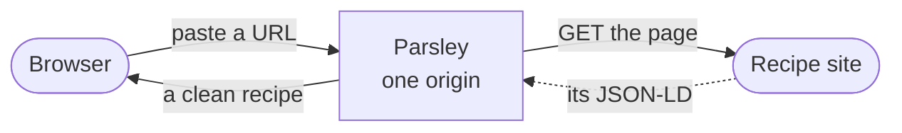

<div align="center">

# Parsley

**Paste a recipe URL, get the clean recipe back** — ingredients, method, times and yield, lifted out of the essay and the ads.

[](https://github.com/tomerav83/parsley/actions/workflows/ci.yml) [](LICENSE)

[Try it](https://parsley-io.vercel.app) · [Docs](docs/) · [Why it exists](docs/motivation.md) · [Decisions](docs/decisions.md) · [Contributing](CONTRIBUTING.md)

</div>

https://github.com/user-attachments/assets/bd4f5683-fa07-4cc2-8c2a-6d73faf1a206

<div align="center"><i>A 78-second film about what this is and why — rendered from React with Remotion.</i></div>

## How it works

Almost every recipe site already embeds its recipe as `schema.org/Recipe` JSON-LD
so Google can show a rich result. Parsley reads that — one standards-based path,
no per-site scrapers, no LLM, nothing to keep up to date as sites redesign.



- **No scrapers to maintain** — the recipe comes from markup sites publish on
  purpose, so a redesign doesn't break extraction.
- **A way past walled sites** — when a site blocks server-side readers, paste the
  page source instead: same extractor, no fetch.
- **Nothing is stored** — no database, no accounts, no telemetry. A URL goes in, a
  recipe comes out; the backend keeps no state between requests.
- **Built to cook from** — an ingredients checklist, the method one step at a
  time with the timing pulled out of each step, light and dark, and a print
  stylesheet that flattens it all onto one page.
- **Honest failures** — every error has a code from a fixed taxonomy, and the UI
  offers the recovery that code allows — including a one-click, prefilled
  [issue report](.github/ISSUE_TEMPLATE/extraction-failure.md).

## Quick start

Needs Docker (with Compose) and `make`. No environment variables and no secrets
are required — everything runs on defaults, and `.env.example` documents the
optional knobs.

```sh
make start
```

- App (Vite dev server, HMR): http://localhost:5173
- Same-origin QA (nginx, mirrors production routing): http://localhost:8080
- API (OpenAPI docs at `/docs`): http://localhost:8000

**Without Docker** — needs [uv](https://docs.astral.sh/uv/) and Node 22:

```sh
cd backend  && uv run uvicorn app.main:app --reload   # :8000
cd frontend && npm install && npm run dev             # :5173, proxies /api to :8000
```

## The API

Two endpoints, both returning the same `Recipe`. `POST /api/extract` fetches the
page for you:

```sh
curl -X POST localhost:8000/api/extract \
  -H 'Content-Type: application/json' \
  -d '{"url": "https://a-food-blog.com/weeknight-shakshuka"}'
```

```json
{
  "name": "Weeknight Shakshuka",
  "image": "https://example.com/shakshuka.jpg",
  "author": "Sam Cook",
  "ingredients": ["1 can crushed tomatoes", "4 eggs", "1 onion, diced", "2 tsp cumin"],
  "steps": ["Sauté the onion until soft.", "Add tomatoes and cumin, simmer 10 minutes."],
  "prep_time_minutes": 10,
  "cook_time_minutes": 20,
  "total_time_minutes": 30,
  "yields": "4 servings",
  "source_url": "https://a-food-blog.com/weeknight-shakshuka",
  "site_name": "Food Blog"
}
```

`POST /api/extract-html` takes `{ html, url }` instead and skips the fetch — it
backs the paste fallback for sites that block server-side readers. Failures come
back as `{ code, message }` with a code from a
[fixed taxonomy](docs/architecture.md#backend), so the UI can offer the right
recovery. `GET /api/health` is the liveness check.

## Commands

| Command | What it does |
| --- | --- |
| `make start` / `stop` / `restart` | Dev stack up/down (`S=backend\|frontend` targets one service) |
| `make rebuild` | Rebuild images — after a new dependency or a `Dockerfile.dev` change |
| `make logs` / `make status` | Tail container logs / list containers |
| `make lint` / `make format` | Ruff (backend) + oxlint and prettier (frontend) |
| `make test` | Backend tests (`uv run pytest`) |
| `make build` | Production frontend build |
| `make loadtest-smoke` (and friends) | k6 load tests, **local only** — see [load testing](docs/load-testing.md) |

The `lint`, `test` and `build` targets run on the host, so they need `uv` and
Node 22 installed even if you develop in Docker. Before opening a PR, run the
[same three checks CI runs](CONTRIBUTING.md#before-you-open-a-pr).

Production deploys from the connected Vercel project — see
[deploy.md](docs/deploy.md).

## Architecture

A React/TypeScript SPA (`frontend/`) and a FastAPI backend (`backend/app/`),
always served from one origin: the SPA calls relative `/api/*` and a rewrite
routes it to the backend — Vercel in production, nginx locally. No CORS, no API
base URL. `contract.json` pins the API shape and error taxonomy, and is asserted
by tests on both sides. The backend holds no state.

CI runs lint, typecheck, tests, a smoke load test, visual regression via Argos
and a Lighthouse budget.

## Docs

Read in this order if you're new — or start at the [docs index](docs/).

| | |
| --- | --- |
| [motivation.md](docs/motivation.md) | The problem, the goals, the non-goals, what's next |
| [architecture.md](docs/architecture.md) | How the system fits together, request path, module layout |
| [implementation.md](docs/implementation.md) | How the pieces work: extraction, fetching, the UI flow, tests |
| [decisions.md](docs/decisions.md) | Why it's built this way, what was rejected, what would reopen it |

Operational detail: [deploy.md](docs/deploy.md) ·
[load-testing.md](docs/load-testing.md) ·
[visual-regression.md](docs/visual-regression.md).

## Contributing

Bug reports and PRs are welcome — [CONTRIBUTING.md](CONTRIBUTING.md) covers the
setup, the checks and the conventions. If a recipe page won't extract, the
fastest thing you can do is
[file it](https://github.com/tomerav83/parsley/issues/new?template=extraction-failure.md):
the app's failure screen prefills the report for you.

## License

MIT — see [LICENSE](LICENSE).
