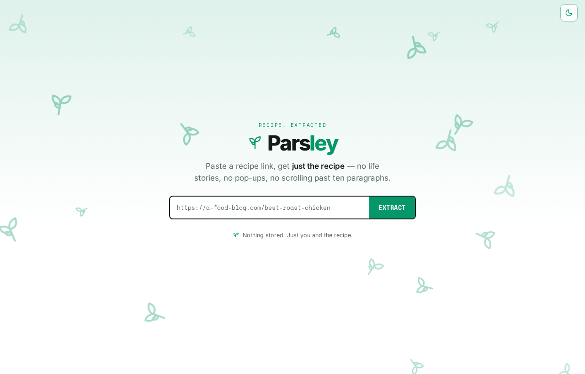
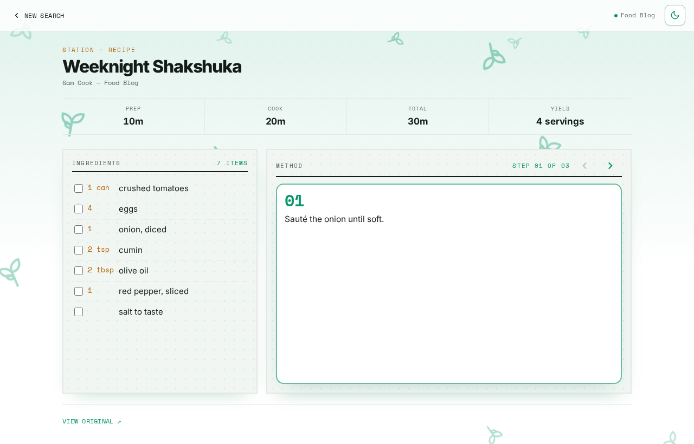

# Parsley

Paste a recipe URL, get the clean recipe back — ingredients, method, times and
yield, lifted out of the essay and the ads.



Almost every recipe site already embeds its recipe as `schema.org/Recipe` JSON-LD
so Google can show a rich result. Parsley reads that. One standards-based path,
no per-site scrapers, no LLM. See [why this exists](docs/motivation.md).



## Quick start

Needs Docker (with Compose) and `make`. No environment variables and no secrets
are required — everything runs on defaults, and `.env.example` documents the
optional knobs.

```sh
make start
```

- App (Vite dev server, HMR): http://localhost:5173
- Same-origin QA (nginx, mirrors production routing): http://localhost:8080
- API (OpenAPI docs at `/docs`): http://localhost:8000

**Without Docker** — needs [uv](https://docs.astral.sh/uv/) and Node 22:

```sh
cd backend  && uv run uvicorn app.main:app --reload   # :8000
cd frontend && npm install && npm run dev             # :5173, proxies /api to :8000
```

## The API

Two endpoints, both returning the same `Recipe`. `POST /api/extract` fetches the
page for you:

```sh
curl -X POST localhost:8000/api/extract \
  -H 'Content-Type: application/json' \
  -d '{"url": "https://a-food-blog.com/weeknight-shakshuka"}'
```

```json
{
  "name": "Weeknight Shakshuka",
  "image": "https://example.com/shakshuka.jpg",
  "author": "Sam Cook",
  "ingredients": ["1 can crushed tomatoes", "4 eggs", "1 onion, diced", "2 tsp cumin"],
  "steps": ["Sauté the onion until soft.", "Add tomatoes and cumin, simmer 10 minutes."],
  "prep_time_minutes": 10,
  "cook_time_minutes": 20,
  "total_time_minutes": 30,
  "yields": "4 servings",
  "source_url": "https://a-food-blog.com/weeknight-shakshuka",
  "site_name": "Food Blog"
}
```

`POST /api/extract-html` takes `{ html, url }` instead and skips the fetch — it
backs the paste fallback for sites that block server-side readers. Failures come
back as `{ code, message }` with a code from a
[fixed taxonomy](docs/architecture.md#backend), so the UI can offer the right
recovery. `GET /api/health` is the liveness check.

## Commands

| Command | What it does |
| --- | --- |
| `make start` / `stop` / `restart` | Dev stack up/down (`S=backend\|frontend` targets one service) |
| `make rebuild` | Rebuild images — after a new dependency or a `Dockerfile.dev` change |
| `make logs` / `make status` | Tail container logs / list containers |
| `make lint` / `make format` | Ruff (backend) + oxlint and prettier (frontend) |
| `make test` | Backend tests (`uv run pytest`) |
| `make build` | Production frontend build |
| `make loadtest-smoke` (and friends) | k6 load tests, **local only** — see [load testing](docs/load-testing.md) |

The `lint`, `test` and `build` targets run on the host, so they need `uv` and
Node 22 installed even if you develop in Docker.

Before opening a PR, the same three things CI checks:

```sh
make lint
make test                                  # backend
cd frontend && npm test                    # needs `npx playwright install chromium` once
```

Production deploys from the connected Vercel project — see
[deploy.md](docs/deploy.md).

## Architecture

A React/TypeScript SPA (`frontend/`) and a FastAPI backend (`backend/app/`),
always served from one origin: the SPA calls relative `/api/*` and a rewrite
routes it to the backend — Vercel in production, nginx locally. No CORS, no API
base URL. `contract.json` pins the API shape and error taxonomy, and is asserted
by tests on both sides. The backend holds no state.

CI runs lint, typecheck, tests, a smoke load test, visual regression via Argos
and a Lighthouse budget.

## Docs

Read in this order if you're new:

| | |
| --- | --- |
| [motivation.md](docs/motivation.md) | The problem, the goals, the non-goals, what's next |
| [architecture.md](docs/architecture.md) | How the system fits together, request path, module layout |
| [implementation.md](docs/implementation.md) | How the pieces work: extraction, fetching, the UI flow, tests |
| [decisions.md](docs/decisions.md) | Why it's built this way, what was rejected, what would reopen it |

Operational detail: [deploy.md](docs/deploy.md) ·
[load-testing.md](docs/load-testing.md) ·
[visual-regression.md](docs/visual-regression.md).

## License

MIT — see [LICENSE](LICENSE).
