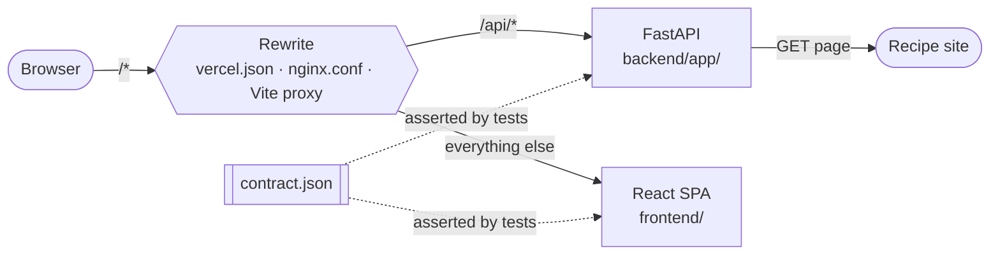

# Architecture

Parsley is a React SPA and a FastAPI service, always served from one origin. It
holds no state between requests: a URL goes in, a recipe comes out.

## The shape



The SPA only ever calls relative `/api/*`. Something in front routes `/api` to
the backend and everything else to the SPA — Vercel in production, nginx locally
on `:8080`, the Vite dev server on `:5173`. There is no API base URL, no CORS,
and no environment variable the app needs to run
([decision 4](decisions.md#4--same-origin-relative-api-no-cors)).

## Repository layout

| Path | What lives there |
|---|---|
| `backend/` | The FastAPI service, its tests and HTML fixtures |
| `frontend/` | The Vite SPA, its tests and self-hosted fonts |
| `docs/` | This documentation |
| `loadtest/` | k6 scripts and the mock upstream they run against |
| `scripts/` | One helper: the Docker credential-config workaround |
| `contract.json` | The API contract, asserted from both sides |
| `vercel.json` · `nginx.conf` | Production routing, and its local mirror |
| `docker-compose.yml` | The dev stack; `.loadtest.yml` is the prod-like harness |
| `Makefile` | Every command in this repo |

## Request path

A submit from the home screen:

1. **SPA** — `useExtractionFlow.submitUrl` starts the request and navigates to
   `/extract`, the *transition screen*: a holding screen that shows a working
   mascot while the request is pending and becomes the failure panel if it fails.
   `recipeExtractor` aborts any in-flight request first, so a superseded submit
   can never land later.
2. **`lib/api.ts`** — `POST /api/extract` with `{ url }`, same-origin.
3. **Route** (`main.py`) — pydantic validates the body, slowapi applies the
   per-IP cap, and the handler delegates to `ExtractionService`.
4. **Fetch** (`fetching/`) — validate the URL, resolve the host and reject
   non-public addresses, then GET with browser headers, following redirects by
   hand and re-validating each hop. A bot-block status retries once through
   curl_cffi with a Chrome TLS fingerprint. Size- and time-capped throughout.
5. **Extract** (`extraction/extractor.py`) — reduce the page (`extraction/html_reducer.py`) to `<head>` plus its JSON-LD,
   parse with `recipe-scrapers`, fall back to the full page if that yields
   nothing. Runs in a worker thread; it is CPU-bound and would otherwise block
   every other request on the instance. recipe-scrapers already strips tags,
   unescapes entities and collapses whitespace, so its strings go out as-is.
6. **Response** — a `Recipe`, or an `ErrorResponse` with a code from the
   `ErrorCode` enum.
7. **SPA** — the response is validated against the zod schema, cached in
   `sessionStorage` by URL, and the flow navigates to `/recipe?url=…`. On failure
   the transition screen morphs into the failure panel in place, offering the
   recovery actions that error code allows.

`POST /api/extract-html` is the same path with steps 4 skipped — the client
supplies HTML it already has.

## Backend

```
backend/app/
├── main.py        FastAPI app, routes, exception handlers
├── services.py    ExtractionService — the seam routes call
├── fetching/
│   ├── fetcher.py       fetch_page: httpx, then curl_cffi on a bot block, under one deadline
│   ├── url_guard.py     the SSRF guard: http(s) only, host must resolve to public IPs only
│   ├── transport/
│   │   ├── clients.py       the httpx and curl_cffi clients, each pinned to the checked IP
│   │   ├── drive.py         drive_fetch: the shared redirect loop and status mapping
│   │   ├── body_decoder.py  size-capped incremental body decode, charset fallback
│   │   └── browser_headers.py  the Chrome header set httpx sends, each header explained
│   └── errors.py        FetchError and its subclasses
├── extraction/
│   ├── extractor.py     HTML → Recipe via recipe-scrapers
│   └── html_reducer.py  cut the page to <head> + JSON-LD before parsing
├── models.py      pydantic models, ErrorCode, AppError
├── rate_limit.py  slowapi limiter and its client-IP key
└── config.py      the only module that reads os.environ
```

Routes stay thin: parse the request, return the service's result.
`ExtractionService` takes its fetcher and extractor as plain callables with real
defaults, so tests inject fakes and neither the network nor a real scraper is
needed to test orchestration. Both endpoints share exactly one code path.

Errors are exceptions. An `AppError` subclass carries its own client-facing
`code` and HTTP `status`; one handler in `main.py` renders any of them to an
`ErrorResponse` ([decision 7](decisions.md#7--errors-carry-their-own-status-one-handler-renders-them)).

| Code | Status | Means |
|---|---|---|
| `invalid_url` | 400 | Not http(s), or not a URL |
| `blocked_url` | 400 | Host resolves to a non-public address |
| `site_blocked` | 502 | The site refused us — bot protection |
| `fetch_failed` | 502 | Couldn't fetch: DNS, timeout, size, upstream error |
| `no_recipe` | 422 | Page loaded, no usable recipe markup |
| `error` | 500 | The `AppError` base; never raised directly |

## Frontend

```
frontend/src/
├── app/           the application shell
│   ├── App.tsx            layout route: chrome + <Outlet>
│   ├── router/            route table, typed outlet-context hook
│   ├── screens/           Home, Extract, Paste, Recipe (+ its loader and boundary)
│   ├── transitions/       useExtractionFlow, useRouteChoreography, screen order
│   └── LiquidTransition/  the wave overlay
├── components/    shared, feature-agnostic (Background, ThemeToggle, BackButton)
├── features/
│   ├── extract/   the extraction lifecycle: state machine, error copy, forms, mascot
│   └── recipe/    rendering a recipe: card, ingredients, method, timings
└── lib/           api client + zod schema, session cache, repository, guards
```

Direction is `lib → components → features → app`. One folder per component, no
barrel files, tests co-located, `@/` aliases `src/`
([decision 20](decisions.md#20--one-folder-per-component-no-barrel-files)).

**State ownership.** `useExtractionFlow` owns the journey — the current URL, the
last-requested URL, and every navigation the flow performs — and is handed to the
screens through the router's outlet context, typed by `useAppOutlet`. Inside it,
`useRecipeExtractor` owns request state as an explicit four-status machine
(`idle | submitting | success | error`) in a pure reducer, so states like "loading
with a stale recipe" cannot be represented. `useRouteChoreography` owns
navigation itself: `go(dir, to)` covers with the wave, swaps under cover, reveals.

**Routes.**

| Path | Screen | Loaded |
|---|---|---|
| `/` | Home — the URL form | eager |
| `/extract` | Transition — working mascot, or the failure panel in place | eager |
| `/paste` | Paste fallback form | lazy chunk |
| `/recipe?url=…` | The recipe, resolved by `recipeLoader` before render | lazy chunk |
| `*` | redirect to `/` | — |

Home and `/extract` are eager because a submit must paint immediately. The recipe
view is lazy and a lint rule keeps it that way
([decision 21](decisions.md#21--the-recipe-view-stays-off-the-first-paint-enforced-by-lint)).
History is arranged so that everything after Home replaces the previous entry:
Back from anywhere lands on Home, never on a transition screen.

## The contract

`contract.json` at the repo root lists the `Recipe` field names and the backend
error codes. `backend/tests/test_contract.py` asserts the pydantic models match
it; `frontend/src/lib/contract.test.ts` asserts the client does. Changing the
contract on purpose means editing all three — the failing test prints the current
values ([decision 6](decisions.md#6--contractjson-at-the-root-asserted-from-both-sides)).

The frontend's error union is a superset: it adds `rate_limited`, `network` and
`unknown`, which the backend never names because they describe the transport or
the client's own view of a failure.

## Deployment topology

| | Production | Local dev | Local QA | Load test |
|---|---|---|---|---|
| Entry | Vercel | `:5173` | `:8080` | `:8000` |
| Routing | `vercel.json` rewrites | Vite dev proxy | `nginx.conf` | direct |
| Backend | Vercel function, `maxDuration` 30 s | uvicorn `--reload` | same | plain uvicorn, 1 vCPU / 2 GB |
| Frontend | Vite build on CDN | Vite HMR | same | not involved |
| Upstream | real recipe sites | real recipe sites | real | mock, ~500 ms latency |

Details in [deploy.md](deploy.md) and [load-testing.md](load-testing.md).

## Where to start reading

The whole backend is a dozen short files; read them in request order —
`main.py` → `services.py` → `fetching/fetcher.py` → `extraction/extractor.py`. That is the entire
server.

On the frontend, four files carry most of the design:

| File | Why it's worth reading first |
|---|---|
| `app/transitions/useExtractionFlow.ts` | The whole user journey in one hook: submit, retry, paste, dismiss |
| `features/extract/recipeExtractor.ts` | Request lifecycle and the abort-on-supersede rule |
| `app/router/router.tsx` | The four screens, what's eager, what's code-split |
| `lib/api.ts` | The typed boundary: schema, error codes, `ExtractError` |

Comments in this codebase explain *why*, not what — the surprising ones usually
mark a decision recorded in [decisions.md](decisions.md).
